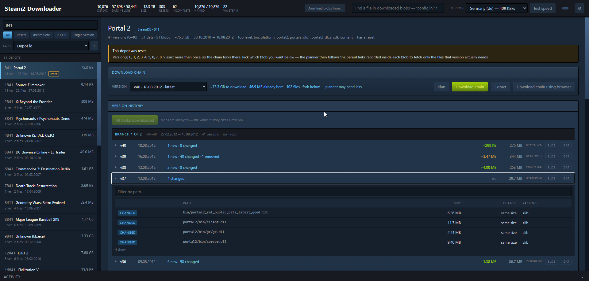

# Steam2 Downloader

[](https://github.com/extremebleem/steam2_downloader/releases/latest)
[](https://github.com/extremebleem/steam2_downloader/releases)
[](https://github.com/extremebleem/steam2_downloader/stargazers)
[](https://github.com/extremebleem/steam2_downloader/actions/workflows/release.yml)


A desktop browser and downloader for the [terarelease](https://de.steam2.download/) Steam2 content
dump: 10 876 depots, 116 339 files, 13.3 TB (12.1 TiB). It shows what the archive holds, resolves
which files a given depot version actually needs, downloads them, verifies them and unpacks them.

Steam2 was Valve's content system before Steam3 and CDN manifests. Its depots are stored as delta
chains of `.dat` payloads with `.blob` metadata beside them, so no single file is a complete
version — extracting version *N* needs every version below it. This tool exists because working
that out by hand across 58 441 blobs is not practical.

A single self-contained executable for Windows and Linux. It starts a local server and opens
your browser.



Every line here was written by [Claude Code](https://claude.com/claude-code) or arrived in a pull
request. The maintainer wrote none of it by hand: 11 078 of the 11 140 source lines came out of
Claude Code sessions — the archive format work, the extractor, the chain planner and the interface —
and the other 62 are the Linux support contributed by [SkyKingPX](https://github.com/SkyKingPX).
Counted over `.cs`, `.js`, `.css`, `.html`, `.yml` and `.md`, excluding the depot key table, the
catalog snapshot and other data files.

## Install and run

Both links always resolve to the newest build. No .NET install and no dependencies — the runtime
is inside the executable. Release notes and older builds are on the
[releases page](https://github.com/extremebleem/steam2_downloader/releases/latest).

**Windows** — [`steam2browser-win-x64.zip`](https://github.com/extremebleem/steam2_downloader/releases/latest/download/steam2browser-win-x64.zip).
Unzip and run `steam2browser.exe`.

```
steam2browser.exe                 # opens http://127.0.0.1:5099
steam2browser.exe --port=6000     # different port
steam2browser.exe --no-browser    # do not launch a browser
```

**Linux** — [`steam2browser-linux-x64.zip`](https://github.com/extremebleem/steam2_downloader/releases/latest/download/steam2browser-linux-x64.zip).
Unzip, mark it executable once, then run it. The browser is opened through `xdg-open`, so on a
machine with no desktop session use `--no-browser` and open the address yourself.

```
chmod +x steam2browser
./steam2browser                   # opens http://127.0.0.1:5099
./steam2browser --port=6000       # different port
./steam2browser --no-browser      # do not launch a browser
```

Everything it writes stays in `steam2info/` next to the executable: the name cache, downloads
(`archive/blobs`, `archive/dats`) and extracted files (`extracted/`).

The release embeds a snapshot of the whole catalog, so the first run needs no network and is ready
in well under a second. Fetching that index instead means 13 MB of `*_dates.txt` plus two ~20 MB
directory listings for the sizes — about 54 MB before anything appears. **Re-download index** in
Settings pulls a fresher one when you want it.

## Features

### Browse depots

Every depot with its versions, dates, sizes and sha256 hashes. Search by depot id or product name;
quote the term for an exact match — `440` also finds 4400 and 14400, `"440"` finds only 440. Each
depot links to its [SteamDB](https://steamdb.info/) page. Dates render in your own locale.

### Resolve a delta chain

Where Valve reset a depot, the same version number exists twice and the chain forks. The planner
follows the parent CRC links recorded inside each blob and picks the right `.dat` by the exact size
the blob records, instead of downloading both branches. Reset depots are split into branches so a
fork does not read as one jumbled history.

### Version history and diffs

Per version: which files were added, changed and removed, with the size delta for each, expandable
like a diff view. Comparison is by path, not by file id — Steam2 assigns a new file id when a file
is rewritten, so matching on ids reports every changed file as both new and removed.

### Search inside depots

A global file search over the manifests of every blob already on disk, grouped by depot. It answers
"which depot ships `client.dll`" without downloading a single `.dat`. Results say when the index is
behind the blobs on disk and offer to rebuild it.

### Download

Parallel, resumable, verified against the sha256 that forms the fourth part of every file name.
Three HTTP mirrors (`de`, `ro`, `us`) serve byte-identical files; the app races them on startup and
picks the fastest, with a BitTorrent swarm as a fourth source.

Blobs are fetched first and dats second, on a couple of sustained connections rather than many
short ones, because the storage speeds a connection up the longer it keeps asking. Blobs for a whole
span of depot ids can be pulled at once — enough to browse history and search files across a chunk
of the archive without paying for any dat.

A browser-side mode saves a chain into a folder you pick, laid out as `blobs/` and `dats/` so the
extractor finds it, skipping files already the right size.

### Extract

Built in. The blob container, manifest, file id tables, AES-128-CFB and zlib chunk handling are all
implemented in process. Output was verified byte-for-byte against the original `extract.exe` on two
depots, one of them with a chain spanning 146 versions.

### Depot packs

A depot is not a game. Counter-Strike: Source is a client depot, a content depot and ten
localization depots, each at its own version — and that mapping is recorded nowhere in the archive,
because it lived on Steam's side and was never dumped. The blobs describe only what is inside one
depot.

So it is written by hand. [`apps/`](apps/) holds one JSON file per Steam appid listing the depots
and versions each build is made of; the app lists them as packs and queues every depot of a build
in one click, each as its own download with its own chain.

Contributions go through a pull request, and a check validates them against the real archive —
a build naming a depot or version that does not exist fails before it can be merged.
[`apps/README.md`](apps/README.md) has the format.

## Things worth knowing about the archive

**A missing decryption key usually does not matter.** 4 758 depots appear in the key table, but that
table only covers depots that are actually encrypted. Every file records a filemode: `1` is plain
zlib and needs no key, only `2` and `3` involve AES. In a sample of 40 depots absent from the key
table, 38 were checkable and every one was unencrypted. So a key is requested only when a file being
extracted really needs one. The original `extract.exe` refuses these depots outright, before it ever
looks at the filemodes.

**223 `(depot, version)` pairs have a blob but no dat**, and 62 depots have gaps in their chain.
Those are flagged `incomplete`, because extraction fails partway through. 303 depots were reset at
some point.

**The mirrors are not interchangeable in behaviour.** They serve identical bytes, but `de` advertises
`Accept-Ranges` and then ignores a `Range` header on `.dat` files, answering `200` with the whole
body instead of `206`. Directory listings are sent chunked with no `Content-Length` at all. Both are
handled: a partial file is never appended to a full-body response, and an interrupted download picks
between resuming on a mirror that honours ranges and restarting on a faster one, whichever finishes
sooner.

## Build from source

Needs the .NET 10 SDK.

```
cd Steam2Browser
dotnet run
```

Release build:

```
dotnet publish Steam2Browser/Steam2Browser.csproj -c Release -r win-x64 --self-contained true \
  -p:PublishSingleFile=true -p:EnableCompressionInSingleFile=true -o out/win-x64

dotnet publish Steam2Browser/Steam2Browser.csproj -c Release -r linux-x64 --self-contained true \
  -p:PublishSingleFile=true -p:EnableCompressionInSingleFile=true -o out/linux-x64
```

Either target builds from either host, which is how the release workflow produces both from one
runner.

## Credits

The archive, the original C++ extractor and the depot key table come from the terarelease dump.
Please mirror and seed it.

Linux support was contributed by [SkyKingPX](https://github.com/SkyKingPX) in
[#6](https://github.com/extremebleem/steam2_downloader/pull/6).

Depot names come from [dr3murr/steam2-winfsp](https://github.com/dr3murr/steam2-winfsp), whose
[`data/depot_labels.tsv`](https://github.com/dr3murr/steam2-winfsp/blob/main/data/depot_labels.tsv)
puts a real product name on 10 870 of the 10 876 depots here. That is painstaking work and it is
what makes the archive searchable at all — a manifest only ever yields folder names like `cstrike`
or `platform`. Depots it marks `Unknown / No Depot` fall through to this app's own naming passes,
which read the manifest inside each blob and ask the Steam store about each depot id.
